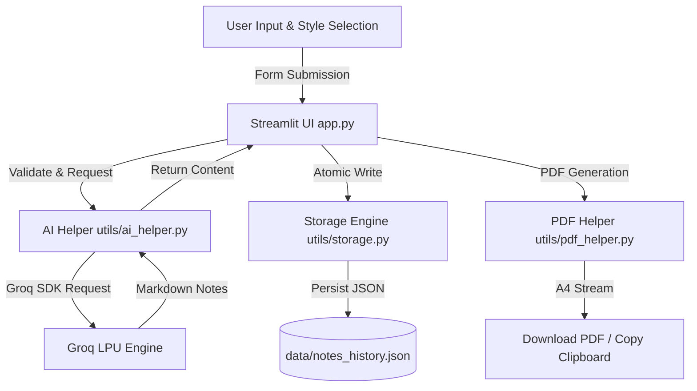

# 📝 AI Notes Generator

> Transform any complex topic into structured, concise, and exam-ready study notes in seconds using ultra-fast LLM inference.

[](https://www.python.org/)
[](https://streamlit.io/)
[](https://groq.com/)
[](https://opensource.org/licenses/MIT)

---

## ✨ Features

- ⚡ **Instant Note Generation**: Turns any academic or technical topic into well-organized Markdown study notes.
- 🎯 **Tailored Note Styles**:
  - **Short Summary**: Quick overviews highlighting key terms and core takeaways.
  - **Detailed Explanation**: Comprehensive, beginner-friendly explanations complete with sections and recaps.
  - **Exam Notes**: Revision-centric notes emphasizing definitions, formulas, key dates, and common exam questions.
- 📄 **Export to PDF**: One-click PDF document generation formatted dynamically using ReportLab.
- 📋 **Copy to Clipboard**: Seamless client-side HTML/JS copy utility for fast note retrieval.
- 💾 **Local History & Persistence**: Automatic JSON storage with atomic writes to ensure zero data corruption.
- 🛡️ **Production-Grade Error Handling**: Clear user feedback for API failures, network timeouts, invalid keys, and rate limits.

---

## 🛠️ Tech Stack

| Technology | Role | Why It Was Chosen |
| :--- | :--- | :--- |
| **Python** | Core Language | Robust ecosystem for AI integration, file handling, and text processing. |
| **Streamlit** | Frontend UI Framework | Provides an intuitive, responsive web UI with state management without HTML/CSS overhead. |
| **Groq API** | LLM Inference Engine | Delivers sub-second token generation speeds powered by Groq LPU hardware. |
| **ReportLab** | PDF Generation | Allows programmatic creation of styled A4 PDF documents directly from Markdown. |
| **JSON** | Local Storage | Zero-configuration file persistence with atomic swap logic for data reliability. |
| **python-dotenv** | Config Management | Manages API keys and environment variables securely outside the codebase. |

---

## 🏗️ Architecture & How It Works



### Execution Pipeline

1. **User Request**: The user enters a topic (e.g., *"Quantum Computing Basics"*) and chooses a note style.
2. **Prompt Construction**: `utils/ai_helper.py` builds system and user prompts engineered for structured Markdown output.
3. **Groq API Inference**: The application sends a low-latency completion request to Groq models (e.g., `openai/gpt-oss-20b`).
4. **Atomic Storage**: On success, `utils/storage.py` appends the entry atomically into `data/notes_history.json`.
5. **Render & Export**: `app.py` renders formatted Markdown, enables browser copying, and builds downloadable PDFs on demand.

---

## 📁 Project Structure

```text
ai-notes-generator/
├── app.py                   # Main Streamlit web application & session state controller
├── utils/
│   ├── ai_helper.py         # Groq API client integration & error translation
│   ├── pdf_helper.py        # ReportLab PDF styling & layout builder
│   └── storage.py           # Atomic JSON persistence & history management
├── data/
│   └── notes_history.json   # Local history store (auto-created on first save)
├── requirements.txt         # Project Python dependencies
├── .env.example             # Template for environment variables
└── README.md                # Project documentation
```

---

## 🚀 Installation & Setup

### Prerequisites

- **Python 3.10+** installed on your system.
- A **Groq API Key** (obtainable from [Groq Console](https://console.groq.com/)).

### Step-by-Step Setup

1. **Clone the Repository**
   ```bash
   git clone https://github.com/your-username/ai-notes-generator.git
   cd ai-notes-generator
   ```

2. **Create a Virtual Environment**
   ```bash
   # On macOS/Linux
   python3 -m venv venv
   source venv/bin/activate

   # On Windows (PowerShell)
   python -m venv venv
   .\venv\Scripts\Activate.ps1
   ```

3. **Install Dependencies**
   ```bash
   pip install -r requirements.txt
   ```

4. **Configure Environment Variables**
   Create a `.env` file in the project root:
   ```bash
   cp .env.example .env
   ```
   Edit `.env` and insert your Groq API key:
   ```env
   GROQ_API_KEY=gsk_your_actual_groq_api_key_here
   GROQ_MODEL=openai/gpt-oss-20b
   ```

5. **Run the Application**
   ```bash
   streamlit run app.py
   ```
   Open your browser to `http://localhost:8501`.

---

## ⚙️ Environment Variables

| Variable | Required | Default | Description |
| :--- | :---: | :--- | :--- |
| `GROQ_API_KEY` | **Yes** | — | Groq API authentication key starting with `gsk_`. |
| `GROQ_MODEL` | No | `openai/gpt-oss-20b` | Target Groq model identifier for completions. |

---

## 📖 Usage Guide

1. **Enter Topic**: Type any topic in the input field (e.g., *"Photosynthesis"*, *"Python Decorators"*, *"French Revolution"*).
2. **Select Style**: Choose **Short Summary**, **Detailed Explanation**, or **Exam Notes**.
3. **Generate Notes**: Click **✨ Generate notes** to trigger inference.
4. **Review & History**: The generated note displays immediately and is saved to the sidebar history.
5. **Copy / Download**: Click **📋 Copy notes** or **⬇️ Download PDF** for offline revision.

---

## 📝 Example Output

### Input Topic: `Photosynthesis` (Style: Exam Notes)

````markdown
# Photosynthesis: Quick Revision Notes

### 🔑 Key Definitions
- **Photosynthesis**: The chemical process by which green plants convert light energy into chemical energy (glucose).
- **Chlorophyll**: Green pigment located in chloroplasts that absorbs light energy.
- **Stomata**: Microscopic pores on leaves for gas exchange ($CO_2$ in, $O_2$ out).

---

### 🧪 Chemical Equation
$$\text{6CO}_2 + \text{6H}_2\text{O} \xrightarrow{\text{Light + Chlorophyll}} \text{C}_6\text{H}_{12}\text{O}_6 + \text{6O}_2$$

---

### 💡 Two Main Stages
1. **Light-Dependent Reactions** (Occurs in Thylakoid Membranes):
   - Absorbs light energy to split water ($H_2O$).
   - Releases Oxygen ($O_2$) as a byproduct.
   - Produces ATP and NADPH.
2. **Light-Independent Reactions / Calvin Cycle** (Occurs in Stroma):
   - Uses ATP and NADPH to fix Carbon Dioxide ($CO_2$).
   - Synthesizes Glucose ($C_6H_{12}O_6$).

---

### 📌 Common Exam Questions
- **Q: Where does the oxygen byproduct originate?**  
  *A: Photolysis of water molecules during light-dependent reactions, NOT carbon dioxide.*
- **Q: Name limiting factors of photosynthesis.**  
  *A: Light intensity, $CO_2$ concentration, and temperature.*
````

---

## ⚖️ Design Decisions & Tradeoffs

- **Groq LPU vs Direct OpenAI**: Groq was selected over standard cloud APIs due to extreme generation speed, reducing student waiting time from ~10s to <1s.
- **Local JSON vs Database**: Using a structured JSON file avoids external database dependencies (e.g., PostgreSQL/SQLite overhead), allowing instant local execution.
- **Atomic File Writing**: `storage.py` uses temporary file creation before replacing `notes_history.json`, ensuring data integrity if app crashes mid-write.
- **Custom HTML Clipboard Component**: Streamlit lacks native clipboard support; an isolated HTML/JS component handles safe browser copy without sending text to external servers.

---

## ⚠️ Limitations

- **LLM Hallucination Risk**: Notes are generated probabilistically and should be cross-verified against official academic course material.
- **No Real-Time Web Grounding**: Information is limited to the model's pre-trained weights (no web search RAG).
- **Single-User Scope**: Local JSON history is designed for local desktop use, not concurrent multi-user production hosting.

---

## 🔮 Future Improvements

- [ ] **RAG (Retrieval-Augmented Generation)**: Upload lecture PDFs/slides to extract grounded study notes.
- [ ] **Flashcard & Quiz Generator**: Automatically transform generated notes into interactive study flashcards.
- [ ] **Database Integration**: Replace JSON with SQLite/PostgreSQL for multi-user cloud deployment.
- [ ] **Voice Note Input**: Integrate Groq Whisper API to convert spoken lectures into study notes.
- [ ] **Multi-Language Support**: Enable note generation and translation across multiple languages.

---

## 🤝 Contributing

Contributions are welcome! Follow these steps:

1. Fork the Project.
2. Create a Feature Branch (`git checkout -b feature/AmazingFeature`).
3. Commit your Changes (`git commit -m 'Add some AmazingFeature'`).
4. Push to the Branch (`git push origin feature/AmazingFeature`).
5. Open a Pull Request.

---

## 📜 License

Distributed under the **MIT License**. See `LICENSE` for more information.

---

## 👤 Author

**AI Notes Generator Team**
- GitHub: [@your-username](https://github.com/your-username)
- Project Link: [https://github.com/your-username/ai-notes-generator](https://github.com/your-username/ai-notes-generator)
